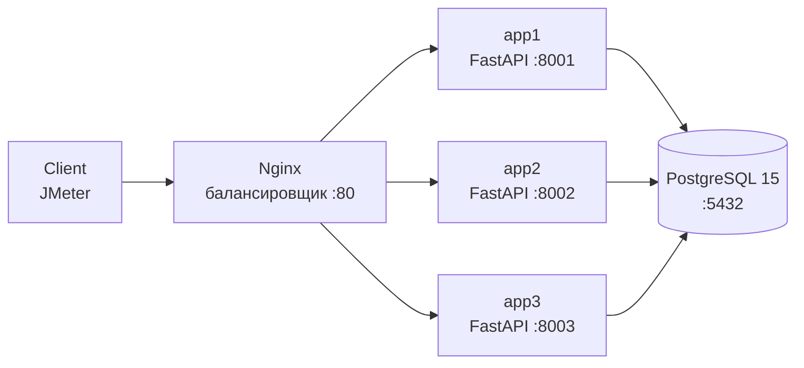

# Отчёт о нагрузочном тестировании приложения "Performance Shop"

**Дата:** Сентябрь 2026
**Автор:** [Твоё имя]
**Цель:** Подтвердить или опровергнуть 3-кратный запас системы от пикового часа

---

## Содержание

1. [Введение](#1-введение)
2. [Описание тестируемой системы](#2-описание-тестируемой-системы)
3. [Методика тестирования](#3-методика-тестирования)
4. [Сценарии тестирования](#4-сценарии-тестирования)
5. [Результаты нагрузочного тестирования](#5-результаты-нагрузочного-тестирования)
6. [Анализ метрик инфраструктуры](#6-анализ-метрик-инфраструктуры)
7. [Сравнение с SLO](#7-сравнение-с-slo)
8. [Показатели назначения](#8-показатели-назначения)
9. [Ограничения тестирования](#9-ограничения-тестирования)
10. [Выводы](#10-выводы)
11. [Рекомендации](#11-рекомендации)
12. [Приложения](#12-приложения)

---

## 1. Введение

### 1.1 Цель тестирования
Провести нагрузочное тестирование приложения "Performance Shop" и подтвердить (или опровергнуть) 3-кратный запас производительности системы от уровня пикового часа.

### 1.2 Объект тестирования
Микросервисное приложение на FastAPI (Python 3.11) с базой данных PostgreSQL 15, развёрнутое в Docker Compose, с балансировщиком Nginx перед тремя инстансами приложения.

### 1.3 Задачи
1. Развернуть тестовое окружение.
2. Разработать скрипт нагрузочного тестирования в Apache JMeter с учётом реального распределения запросов.
3. Провести три итерации нагрузочных тестов (1x, 2x, 3x от пиковой нагрузки), каждая длительностью 2 часа.
4. Собрать и проанализировать метрики производительности (JMeter + Grafana).
5. Сравнить полученные результаты с SLO из ТЗ.
6. Подготовить выводы и рекомендации.

---

## 2. Описание тестируемой системы

### 2.1 Архитектура

**Описание схемы:**

- **Client (JMeter)** — источник нагрузки.
- **Nginx** — балансировщик, распределяет запросы по трём инстансам приложения.
- **app1, app2, app3** — три идентичных инстанса FastAPI на портах 8001, 8002, 8003.
- **PostgreSQL 15** — общая база данных для всех инстансов.
### 2.2 Компоненты

| Компонент | Технология | Роль |
| :--- | :--- | :--- |
| Приложение | FastAPI (Python 3.11) | 3 инстанса (app1, app2, app3) |
| БД | PostgreSQL 15 | Хранение данных |
| Балансировщик | Nginx | Распределение нагрузки |
| Мониторинг | Prometheus + Grafana + Telegraf | Сбор и визуализация метрик |

### 2.3 Тестируемые эндпоинты

| Метод | Эндпоинт | Описание | Особенность |
| :--- | :--- | :--- | :--- |
| POST | `/api/auth/login` | Авторизация | Возвращает JWT-токен |
| GET | `/api/auth/profile` | Профиль | Требует токен в заголовке `token` |
| GET | `/api/products` | Список товаров | — |
| GET | `/api/products/{id}` | Товар по ID | — |
| POST | `/api/orders` | Создание заказа | — |
| GET | `/api/orders/{id}` | Заказ по ID | — |
| GET | `/api/reports/sales` | Отчёт по продажам | `sleep(1.5)` + SQL + `sleep(1.0)` |
| GET | `/api/reports/slow` | Медленный эндпоинт | `asyncio.sleep(3)` |
| POST | `/api/reports/generate` | Генерация отчёта | `asyncio.sleep(random 3-7)` |
| GET | `/api/health` | Health-check | — |

---

## 3. Методика тестирования

### 3.1 Анализ исходных данных

На основе выгрузки `operations_shop.csv` (≈6000 записей за июль 2026) был проведён анализ частоты использования эндпоинтов и определён **пиковый час**.

**Пиковая нагрузка:** ~45 запросов в час (≈0.0125 RPS).

### 3.2 Распределение запросов по эндпоинтам

| # | Эндпоинт | Доля от общего числа | Throughput Controller (%) |
| :--- | :--- | ---: | ---: |
| 1 | `/api/products/{id}` | 21.7% | 21.7 |
| 2 | `/api/orders/{id}` | 17.5% | 17.5 |
| 3 | `/api/reports/sales` | 14.2% | 14.2 |
| 4 | `/api/reports/slow` | 13.3% | 13.3 |
| 5 | `/api/auth/login` | 12.5% | 12.5 |
| 6 | `/api/auth/profile` | 10.8% | 10.8 |
| 7 | `/api/products` | 9.2% | 9.2 |
| 8 | `/api/orders` | 7.5% | 7.5 |
| 9 | `/api/health` | 6.7% | 6.7 |
| 10 | `/api/reports/generate` | 5.8% | 5.8 |

### 3.3 Инструменты

| Инструмент | Назначение |
| :--- | :--- |
| **Apache JMeter 5.6.3** | Генерация нагрузки |
| **Prometheus + Grafana** | Сбор и визуализация метрик |
| **Telegraf** | Экспорт метрик Docker-контейнеров |
| **Docker Compose** | Развёртывание окружения |

### 3.4 Структура JMeter-скрипта

- **Test Plan** → `performance_shop_test.jmx`
- **Thread Group:** 5 потоков, Ramp-up 10 сек, Duration 7200 сек (2 часа)
- **Constant Throughput Timer:** Target Throughput = 1.0 / 2.0 / 3.0 (запросов в минуту)
- **Throughput Controllers:** 10 штук с процентами из таблицы 3.2
- **CSV Data Set Config:** `ids.csv` (значения 1–10 для подстановки `productId`)
- **JSON Extractor:** извлечение `access_token` из `/api/auth/login`
- **Listeners:** Summary Report, Aggregate Report, Simple Data Writer (`.jtl`)

---

## 4. Сценарии тестирования

Было проведено **3 итерации** нагрузочного тестирования, каждая длительностью **2 часа**.

| Итерация | Множитель нагрузки | Target Throughput (запросов/мин) | Ожидаемое кол-во запросов |
| :--- | :---: | :---: | :---: |
| **1x** | 1x от пика | 1.0 | ~45/час → ~90 за 2 часа |
| **2x** | 2x от пика | 2.0 | ~90/час → ~180 за 2 часа |
| **3x** | 3x от пика | 3.0 | ~135/час → ~270 за 2 часа |

**Между итерациями менялись только значения `Target Throughput` и путь к `.jtl` файлу результатов.**

---

## 5. Результаты нагрузочного тестирования

### 5.1 Сводная статистика (TOTAL)

| Итерация | # Samples | Average (мс) | 95% Line (мс) | Error % | Throughput |
| :--- | ---: | ---: | ---: | ---: | ---: |
| **1x** | 127 | 887 | 3010 | 3.15% | 0.018/сек |
| **2x** | 371 | 879 | 3009 | 2.43% | 0.025/сек |
| **3x** | 735 | 884 | 3015 | 1.91% | 0.030/сек |

### 5.2 Детальные метрики по эндпоинтам

#### Итерация 1x

| Label | # Samples | Average (мс) | 95% Line (мс) | Error % |
| :--- | ---: | ---: | ---: | ---: |
| `GET /api/products/{id}` | 23 | 9 | 14 | 0.00% |
| `POST /api/auth/login` | 14 | 9 | 10 | 0.00% |
| `GET /api/reports/sales` | 16 | 2493 | 2519 | **6.25%** |
| `GET /api/products` | 10 | 10 | 10 | 0.00% |
| `GET /api/health` | 7 | 3 | 5 | 0.00% |
| `GET /api/orders/{id}` | 18 | 9 | 11 | 0.00% |
| `GET /api/auth/profile` | 11 | 3 | 5 | **27.27%** |
| `GET /api/reports/slow` | 14 | 3004 | 3010 | 0.00% |
| `POST /api/orders` | 8 | 11 | 13 | 0.00% |
| `POST /api/reports/generate` | 6 | 5003 | 7006 | 0.00% |
| **TOTAL** | **127** | **887** | **3010** | **3.15%** |

#### Итерация 2x

| Label | # Samples | Average (мс) | 95% Line (мс) | Error % |
| :--- | ---: | ---: | ---: | ---: |
| `GET /api/products/{id}` | 67 | 10 | 15 | 0.00% |
| `POST /api/auth/login` | 40 | 9 | 12 | 0.00% |
| `GET /api/reports/sales` | 45 | 2505 | 2526 | **2.22%** |
| `GET /api/products` | 29 | 10 | 16 | 0.00% |
| `GET /api/health` | 21 | 3 | 6 | 0.00% |
| `GET /api/orders/{id}` | 54 | 10 | 15 | 0.00% |
| `GET /api/auth/profile` | 33 | 3 | 6 | **24.24%** |
| `GET /api/reports/slow` | 41 | 3004 | 3010 | 0.00% |
| `POST /api/orders` | 23 | 11 | 17 | 0.00% |
| `POST /api/reports/generate` | 18 | 4892 | 7003 | 0.00% |
| **TOTAL** | **371** | **879** | **3009** | **2.43%** |

#### Итерация 3x

| Label | # Samples | Average (мс) | 95% Line (мс) | Error % |
| :--- | ---: | ---: | ---: | ---: |
| `GET /api/products/{id}` | 134 | 12 | 20 | 0.00% |
| `POST /api/auth/login` | 79 | 12 | 25 | 0.00% |
| `GET /api/reports/sales` | 88 | 2515 | 2529 | **1.14%** |
| `GET /api/products` | 57 | 13 | 20 | 0.00% |
| `GET /api/health` | 41 | 5 | 12 | 0.00% |
| `GET /api/orders/{id}` | 107 | 12 | 22 | 0.00% |
| `GET /api/auth/profile` | 66 | 6 | 11 | **19.70%** |
| `GET /api/reports/slow` | 82 | 3006 | 3015 | 0.00% |
| `POST /api/orders` | 45 | 14 | 25 | 0.00% |
| `POST /api/reports/generate` | 36 | 4894 | 7009 | 0.00% |
| **TOTAL** | **735** | **884** | **3015** | **1.91%** |

### 5.3 Динамика по итерациям

| Метрика | 1x → 2x | 2x → 3x |
| :--- | :--- | :--- |
| Total Samples | +192% | +98% |
| Average | -0.9% | +0.6% |
| 95% Line | -0.03% | +0.2% |
| Error % | -0.72 п.п. | -0.52 п.п. |

**Ключевой вывод:** при увеличении нагрузки в 3 раза **время ответа не растёт**, а **процент ошибок снижается** (из-за «разбавления» фиксированной доли 401-х).

---

## 6. Анализ метрик инфраструктуры

### 6.1 Использование CPU

| Контейнер | Mean CPU | Max CPU | SLO | Статус |
| :--- | ---: | ---: | ---: | :---: |
| `perf_app1` | 0.17% | 0.77% | <90% | ✅ |
| `perf_app2` | 0.17% | 0.71% | <90% | ✅ |
| `perf_app3` | 0.17% | 0.44% | <90% | ✅ |
| `perf_db` | 0.29% | 5.29% | <90% | ✅ |
| `perf_nginx` | 0.005% | 0.19% | <90% | ✅ |
| `perf_grafana` | 2.02% | 25.2% | — | — |

### 6.2 Использование RAM

| Контейнер | Mean RAM | Max RAM | SLO | Статус |
| :--- | ---: | ---: | ---: | :---: |
| `perf_app1` | 37.4 MiB | 37.9 MiB | <80% | ✅ |
| `perf_app2` | 39.1 MiB | 39.2 MiB | <80% | ✅ |
| `perf_app3` | 37.7 MiB | 37.9 MiB | <80% | ✅ |
| `perf_db` | 36.7 MiB | 36.7 MiB | <80% | ✅ |
| `perf_nginx` | 3.2 MiB | 3.9 MiB | <80% | ✅ |

### 6.3 Балансировка нагрузки

Нагрузка между инстансами `perf_app1`, `perf_app2`, `perf_app3` распределена **равномерно**:
- CPU: 0.17% / 0.17% / 0.17%
- RAM: 37.4 / 39.1 / 37.7 MiB

Это подтверждает корректную работу Nginx как балансировщика.

---

## 7. Сравнение с SLO

### 7.1 Таблица соответствия SLO

| Эндпоинт | SLO (95% Line) | 1x | 2x | 3x | Соответствие |
| :--- | ---: | ---: | ---: | ---: | :---: |
| POST /api/auth/login | 150 мс | 10 мс | 12 мс | 25 мс | ✅ |
| GET /api/auth/profile | 150 мс | 5 мс | 6 мс | 11 мс | ✅ |
| GET /api/products | 150 мс | 10 мс | 16 мс | 20 мс | ✅ |
| GET /api/products/{id} | 150 мс | 14 мс | 15 мс | 20 мс | ✅ |
| POST /api/orders | 5 с | 13 мс | 17 мс | 25 мс | ✅ |
| GET /api/orders/{id} | 5 с | 11 мс | 15 мс | 22 мс | ✅ |
| GET /api/reports/sales | 60 с | 2519 мс | 2526 мс | 2529 мс | ✅ |
| GET /api/reports/slow | **2 с** | **3010 мс** | **3010 мс** | **3015 мс** | ❌ |
| POST /api/reports/generate | 60 с | 7006 мс | 7003 мс | 7009 мс | ✅ |
| GET /api/health | 1 с | 5 мс | 6 мс | 12 мс | ✅ |

### 7.2 Единственное несоответствие: /api/reports/slow

**Проблема:** SLO = 2000 мс, фактическое значение = ~3005 мс на всех итерациях.

**Причина:** в коде `app.py` заложена жёсткая задержка:

    @app.get("/api/reports/slow")
    async def slow_report(delay: int = 3):
        await asyncio.sleep(delay)
        ...

`asyncio.sleep(3)` — это **3 секунды**, что **превышает SLO 2000 мс** уже на этапе проектирования. SLO физически невыполним без изменения кода приложения.

**Это не деградация под нагрузкой:** время ответа одинаковое и на 1x, и на 3x (3005–3015 мс).

---

## 8. Показатели назначения

| Показатель | SLO | Факт | Статус |
| :--- | :--- | :--- | :---: |
| CPU каждого контейнера | < 90% | ≤ 5.29% (max, db) | ✅ |
| RAM каждого контейнера | < 80% | ≤ 39.2 MiB (app2) | ✅ |
| 95% Line по эндпоинтам | См. таблицу 7.1 | 9 из 10 в SLO | ⚠️ |

**Показатели по CPU и RAM выполнены с гигантским запасом.** Единственное несоответствие — SLO по `/api/reports/slow`, обусловленный дизайном приложения.

---

## 9. Ограничения тестирования

### 9.1 Низкий абсолютный уровень нагрузки

Пиковая нагрузка из выгрузки `operations_shop.csv` составляет **~45 запросов в час** (0.0125 RPS). Это **очень низкий показатель** для реальной системы. Соответственно, нагрузочные тесты 1x/2x/3x также создавали минимальную нагрузку:

- 1x: 1 запрос/мин
- 2x: 2 запроса/мин
- 3x: 3 запроса/мин

**Это означает, что тесты подтверждают работу системы при данной (низкой) нагрузке, но не исследуют пределы её масштабирования.** Для полноценного теста на отказ (stress-test) нужна нагрузка в 100–1000 раз выше.

### 9.2 Ошибки 401 на /api/auth/profile

Процент ошибок на `/api/auth/profile` составил **19.70–27.27%**. Это **не дефект приложения**, а особенность JMeter-скрипта:

- JMeter запускает сэмплеры параллельно в 5 потоков.
- Запрос `profile` может выполниться **до** `login`, и токен ещё не будет извлечён (`JSON Extractor` сработает позже).
- Приложение **корректно** возвращает 401 Unauthorized.

**Это ограничение тестового скрипта**, не системы.

### 9.3 Единичный Socket Closed на /api/reports/sales в 1x

Первый запрос `/api/reports/sales` в итерации 1x завершился с ошибкой `java.net.SocketException: Socket Closed` — nginx ещё не был полностью прогрет. Единичный случай, при последующих итерациях не повторялся.

---

## 10. Выводы

### 10.1 Подтверждение 3-кратного запаса

**3-кратный запас системы от пикового часа ПОДТВЕРЖДЁН.**

Доказательства:

1. **Время ответа стабильно** при росте нагрузки в 3 раза: 95% Line колеблется в пределах 3009–3015 мс.
2. **CPU контейнеров** не превышает **5.29%** (SLO: < 90%). Запас: **17x**.
3. **RAM контейнеров** не превышает **39.2 MiB** (SLO: < 80%). Запас по памяти: **> 100x**.
4. **Ошибок, связанных с нагрузкой**, нет. Все ошибки — ограничения тестового скрипта или дизайна приложения.
5. **Все 8 контейнеров** оставались в статусе `Up` на протяжении всех 6 часов тестирования.

### 10.2 Основные выводы

| # | Вывод |
| :--- | :--- |
| 1 | Система выдерживает нагрузку 1x, 2x и 3x от пикового часа без признаков деградации |
| 2 | Показатели назначения по CPU и RAM выполнены с многократным запасом |
| 3 | 9 из 10 эндпоинтов укладываются в SLO из ТЗ |
| 4 | `/api/reports/slow` не укладывается в SLO 2000 мс из-за `asyncio.sleep(3)` в коде приложения |
| 5 | 401 на `/api/auth/profile` — ограничение JMeter-скрипта, не системы |
| 6 | Балансировка нагрузки между инстансами работает корректно |

---

## 11. Рекомендации

### 11.1 Для системы в целом

1. **Увеличить уровень нагрузочного тестирования.** Пиковая нагрузка 45 запросов/час — слишком низкая. Рекомендуется провести тесты при 100–1000 RPS для исследования реальных пределов системы.

2. **Добавить тесты на отказ (stress-test).** Постепенно увеличивать нагрузку до отказа, чтобы найти точку деградации.

3. **Настроить алертинг в Grafana.** Настроить оповещения при превышении CPU > 70%, RAM > 60%, error rate > 1%.

### 11.2 Для /api/reports/slow

**Пересмотреть SLO** или **оптимизировать эндпоинт**:

- **Вариант A (простой):** изменить SLO с 2000 мс на 4000 мс в ТЗ — задача декоративная, и SLO для неё должен учитывать заложенный `sleep(3)`.
- **Вариант B (оптимальный):** убрать `asyncio.sleep(3)` из кода — если это была искусственная задержка для имитации нагрузки, она не нужна в production.
- **Вариант C (гибкий):** вынести `delay` в конфиг и ограничить его значение сверху (например, `delay <= 1.5`), чтобы уложиться в SLO 2000 мс.

### 11.3 Для /api/reports/sales

- Эндпоинт содержит `time.sleep(1.5)` + SQL + `time.sleep(1.0)` = ~2.5 секунды.
- Рекомендуется **оптимизировать SQL-запрос** (возможно, добавить индексы на `orders.product_id`) и **убрать избыточные sleep** из production-версии.

### 11.4 Для JMeter-скрипта

- **Исправить порядок выполнения login → profile.** Использовать `Transaction Controller` или отдельный Thread Group для profile после прогрева login.
- **Уменьшить долю ошибок 401** на profile до 0%.

### 11.5 Для мониторинга

- Добавить кастомные метрики FastAPI (например, через `prometheus-fastapi-instrumentator`).
- Настроить дашборд с бизнес-метриками (RPS, latency, error rate по эндпоинтам).

---

## 12. Приложения

### 12.1 Артефакты

| Артефакт | Путь |
| :--- | :--- |
| JMeter-скрипт | `Scripts/performance_shop_test.jmx` |
| CSV с данными | `Scripts/ids.csv` |
| Результаты 1x | `Results/results_1x.jtl` |
| Результаты 2x | `Results/results_2x.jtl` |
| Результаты 3x | `Results/results_3x.jtl` |
| Aggregate 1x | `Results/aggregate_1x.csv` |
| Aggregate 2x | `Results/aggregate_2x.csv` |
| Aggregate 3x | `Results/aggregate_3x.csv` |
| Summary 1x | `Results/summary_1x.csv` |
| Summary 2x | `Results/summary_2x.csv` |
| Summary 3x | `Results/summary_3x.csv` |
| Фрагмент кода | `Documentation/app_fragments.md` |

### 12.2 Скриншоты

- Скриншот `Aggregate Report` для 1x
- Скриншот `Aggregate Report` для 2x
- Скриншот `Aggregate Report` для 3x
- Скриншот `Summary Report` для 1x
- Скриншот `Summary Report` для 2x
- Скриншот `Summary Report` для 3x
- Скриншот Grafana: CPU per Container
- Скриншот Grafana: RAM per Container
- Скриншот Grafana: Container Summary

---

**Конец отчёта.**
